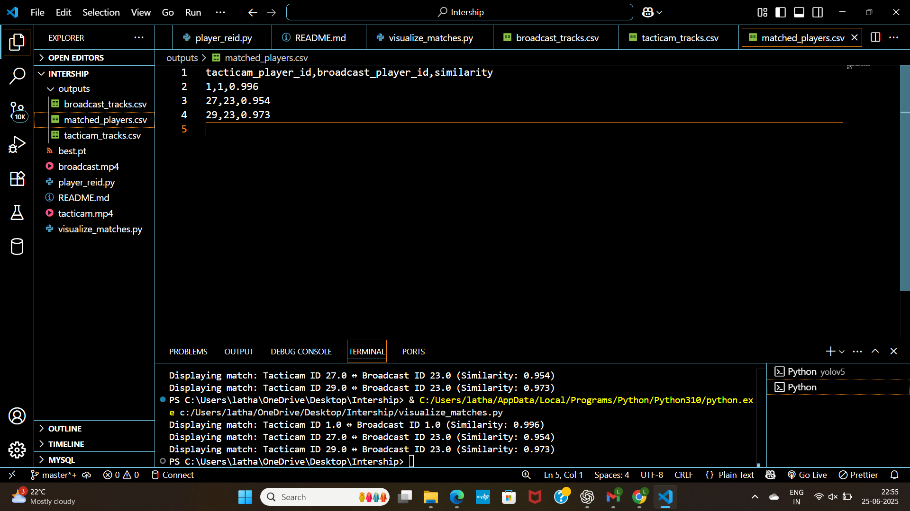
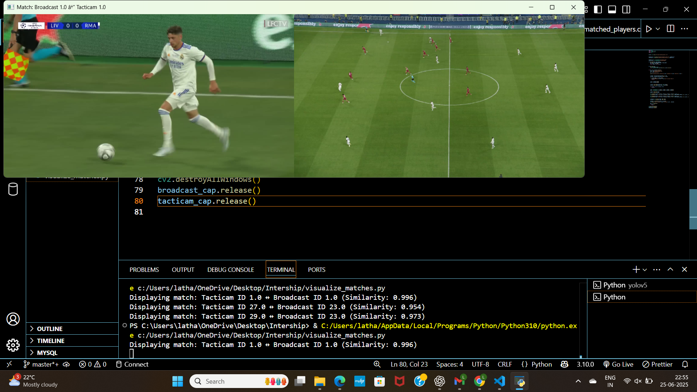
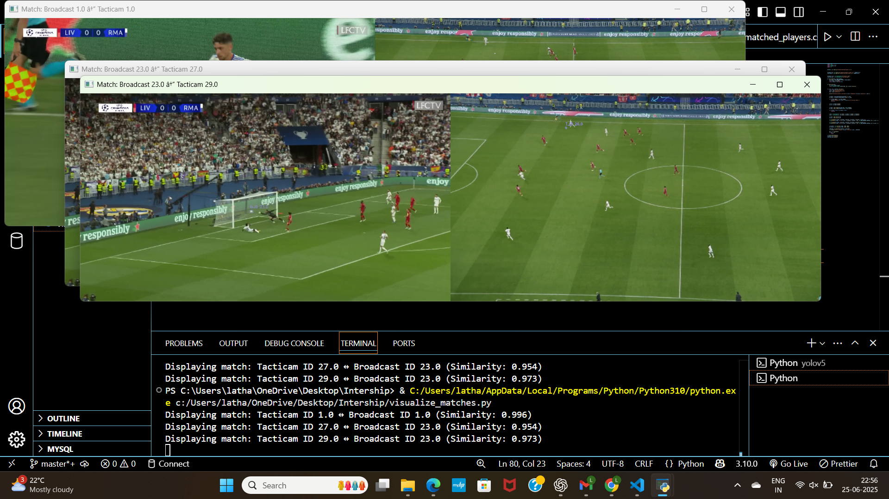

# ⚽ Soccer Player Re-Identification (Cross-Camera Mapping)

This project performs **cross-camera player re-identification** from two soccer game video clips: `broadcast.mp4` and `tacticam.mp4`. It uses object detection (YOLOv8), DeepSORT for tracking, and ResNet50 embeddings to match players between the two views.

---

## 📂 Folder Structure

```
project/
│
├── best.pt                      # Provided YOLOv8 model for player detection
├── broadcast.mp4               # Broadcast camera video
├── tacticam.mp4                # Tacticam camera video
│
├── player_reid.py              # Main script: detection, tracking, and matching
├── visualize_matches.py        #  shows side-by-side visualization of player matches
├── outputs/
│   ├── broadcast_tracks.csv    # YOLO + DeepSORT outputs for broadcast
│   ├── tacticam_tracks.csv     # YOLO + DeepSORT outputs for tacticam
│   └── matched_players.csv     # Final player ID mappings with similarity
│
└── README.md
```

---

## 🛠️ Setup Instructions

### 1. Create Virtual Environment (recommended)

```bash
python -m venv venv
source venv/bin/activate        # Linux/macOS
venv\Scripts\activate           # Windows
```

### 2. Install Required Packages


pip install ultralytics opencv-python pandas numpy torch torchvision deep_sort_realtime scipy
```


---

## ▶️ How to Run

### Step 1: Player Detection, Tracking & Matching


python run player_reid.py


This will:

- Detect and track players in both videos.
- Extract appearance features using ResNet50.
- Compute cosine similarity to match player identities.
- Output CSVs to `outputs/` folder.

### Step 2: Optional – Visualize Matched Players


python run visualize_matches.py


- Opens a window showing side-by-side bounding boxes from both videos.
- ESC to close or skip each frame.

---

## ⚙️ Dependencies

- Python 3.8+
- OpenCV
- Pandas
- NumPy
- Torch
- torchvision
- Ultralytics YOLO
- deep_sort_realtime
- SciPy

Y

## 📌 Notes

- This solution uses **appearance embeddings** and **DeepSORT IDs** for cross-camera re-ID.
- You can extend this by using spatial/temporal consistency, jersey number recognition, or multi-frame feature averaging.
- `best.pt` is a fine-tuned YOLOv8 model for detecting players and ball, provided in the assignment.

---

---

## 📸 Screenshots

### 🎯 Player Matching Results



---

### 🎯 Visualized Matched Players



